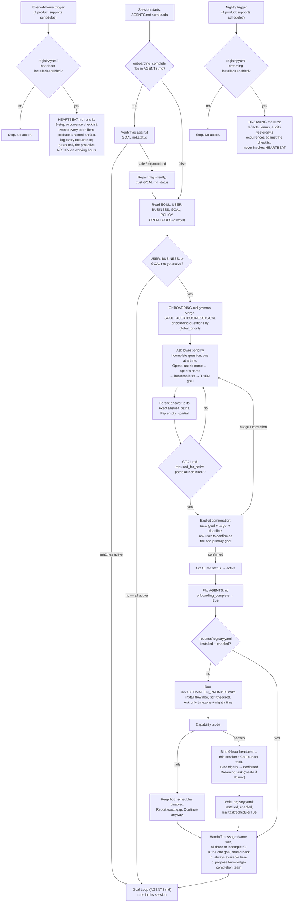

# FLOW.md — Onboarding → Activation Wiring, and How to Verify It

This file has one job: make the end-to-end wiring from a cold fork to a running Co-Founder explicit, so a change to any one file can be checked against the whole chain rather than reviewed in isolation.

## The flow

## Why this file exists

Every arrow above is a claim spread across two or three different files — `AGENTS.md`'s flag references `GOAL.md`'s status; `ONBOARDING.md`'s exit condition references `init/AUTOMATION_PROMPTS.md`'s exact prompt name; `routines/registry.yaml`'s schema has to match what that prompt promises to write; `HEARTBEAT.md`/`DREAMING.md` both have to actually gate on that registry before doing real work. A `grep` can confirm a string exists; it cannot confirm the *chain* still holds after someone edits one link of it. That check needs a reader who understands what each file is claiming — an LLM doing the review, not a script.

## The check

Run this whenever `AGENTS.md`, `ONBOARDING.md`, `SOUL.md`, `USER.md`, `BUSINESS.md`, `GOAL.md`, `HEARTBEAT.md`, `DREAMING.md`, `init/AUTOMATION_PROMPTS.md`, or `routines/registry.yaml` changes — before merging, not after something breaks live.

Read the actual current content of every file in the diagram above (not from memory of a prior review) and answer each of these with a direct yes/no plus the file:line evidence, not a guess:

1. Does `AGENTS.md`'s `onboarding_complete` flag get flipped `true` in the same step that `GOAL.md.status` becomes `active`, and nowhere else? Is there any path that could set the flag `true` while `GOAL.md.status` is not `active`?
2. Does `ONBOARDING.md`'s merged-priority table still match the live `global_priority` values actually present in `SOUL.md`, `USER.md`, `BUSINESS.md`, and `GOAL.md`'s frontmatter — including that the sequence still opens with the user's name, then the agent's name, then business brief, before the goal question? If a priority number or question was added, removed, or renumbered in one of those files, does `ONBOARDING.md` still describe the merge as a live re-derivation rather than depend on its own worked-example table?
3. Is there a path where `GOAL.md.status` could reach `active` by field-population alone, without the explicit user confirmation step? (This exact gap existed once — the merged queue filled every `required_for_active` path but nothing asked the user to confirm it as the one primary goal before flipping status. Confirm the fix in `ONBOARDING.md`'s "Confirming the goal" section is still present and still the only path to `active`.)
4. Does `ONBOARDING.md`'s exit condition still name the exact section title of the install prompt in `init/AUTOMATION_PROMPTS.md`? If that file's heading text changes, does the reference still resolve?
5. Does `routines/registry.yaml`'s schema still contain every field the install prompt in `init/AUTOMATION_PROMPTS.md` says it will write (`installation.status`, `installation.enabled`, both schedules' `automation_id`/`task_id`, `capability_probe.*`, timezone, nightly time)?
6. Do `HEARTBEAT.md` and `DREAMING.md` both still gate their first real action on `routines/registry.yaml`'s `installation`/`schedules.*` being `installed` and `enabled`, exactly as their own "Runtime guard and idempotency" sections claim?
7. Does anything still reference a file or directory that no longer exists (check especially after a deletion — e.g. confirm no leftover reference to the removed `pet/` directory anywhere in the repo)?
8. Does `HEARTBEAT.md`'s and `AGENTS.md`'s "proactive push is an invitation, not the dialogue" rule still hold after any edit to the primary-channel sections?
9. Does the working-hours gate still apply only to proactive notifications, never to the goal action loop itself? Confirm `HEARTBEAT.md`'s "Working-hours gate" section, `USER.md`'s `communication.proactive_window` fields plus its default rule, and the `queued_proactive_notification` checkpoint field all still agree with each other — and that no cadence reference anywhere in the repo still says "hourly" instead of "every 4 hours" (`routines/registry.yaml`'s `schedules.heartbeat.cadence` included).

10. Is `OPEN-LOOPS.md` still listed in `AGENTS.md`'s canonical startup and read unconditionally every session and occurrence? Do its `behavior` contract rules (write on topic-switch in the same turn, close only with evidence or explicit dismissal, logging never substitutes for acting) still hold unmodified?
11. Does `ONBOARDING.md`'s exit step 4 still require all three handoff elements (goal stated back, availability here, knowledge-completion team proposal) as an explicit a/b/c checklist, and does the team proposal still reference an existing `teams/knowledge-completion-charter.md`?
12. Does `HEARTBEAT.md` still open with the 9-step occurrence checklist where every step names its required file write — including the sweep giving every open item a disposition, the mandatory named business artifact, and a run-log entry for every occurrence (quiet ones included)? Does `DREAMING.md` still audit each occurrence against that checklist, and do its ranked gaps land in `second-brain/wiki/gaps/queue.md` and tomorrow's proposed action in the canonical action register — not only in its report?

Report every finding as CONFIRMED (still holds, cite the exact lines) or BROKEN (cite what changed and what it now contradicts). Do not report "looks fine" without having actually re-read the current file content — a stale memory of what these files used to say is exactly the failure mode this check exists to catch.
